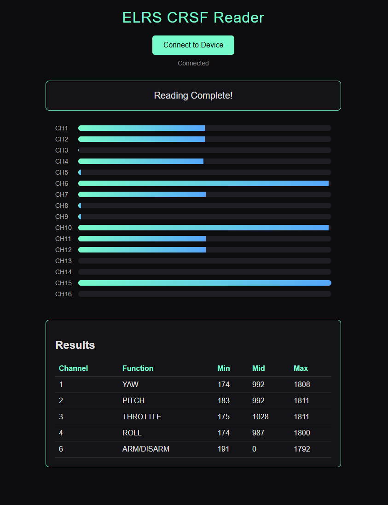

# ELRS CRSF Reader (Powered by ESP32)

An ESP32-based tool for reading, identifying, and measuring RC channels from an ExpressLRS receiver over CRSF.

The project combines ESP32 firmware with a lightweight browser interface. The ESP32 reads the CRSF channel stream from the receiver, guides the user through a channel identification sequence, and sends live channel data and final results to the browser through USB serial.

## Overview

This project was built as a practical way to determine how a radio transmitter is mapped through an ExpressLRS receiver without assuming fixed channel assignments beforehand.

For the primary controls, the tool identifies the corresponding CRSF channel and records its observed minimum, midpoint, and maximum values. It also detects the Arm / Disarm channel and checks the remaining channels for additional active controls.

## Features

- Reads packed CRSF RC channel data from an ExpressLRS receiver
- Displays live values for channels 1-16
- Automatically identifies the primary control channels from user movement
- Records minimum, midpoint, and maximum values for the main axes
- Detects the Arm / Disarm channel
- Checks remaining channels for additional active controls
- Provides a browser-based interface through Web Serial
- Sorts the final results by CRSF channel number

## System Layout

```text
Radio Transmitter
       │
       │ ExpressLRS wireless link
       ▼
ExpressLRS Receiver
       │
       │ CRSF UART @ 420000 baud
       ▼
      ESP32
       │
       │ USB Serial @ 115200 baud
       ▼
Computer / Web Browser
       │
       └── webInterface/elrsCrsfReader.html
```

The radio transmitter remains wireless. The **ExpressLRS receiver is physically connected to the ESP32**, while the **ESP32 is connected to the computer through USB**.

## Hardware

| Component | Purpose |
|---|---|
| ESP32 | CRSF decoding, channel detection, and USB serial communication |
| ExpressLRS receiver | Receives the radio signal and outputs CRSF data |
| ExpressLRS-compatible radio | Provides the stick and switch inputs |
| USB cable | Connects the ESP32 to the computer |

### Receiver Connection

The firmware uses ESP32 UART2 for the CRSF connection.

| Function | ESP32 Pin |
|---|---:|
| CRSF RX | GPIO 21 |
| CRSF TX | GPIO 22 |
| Ground | GND |

UART connections should be crossed between the receiver and ESP32:

```text
ELRS Receiver TX  ─────►  ESP32 GPIO 21 (RX)
ELRS Receiver RX  ◄─────  ESP32 GPIO 22 (TX)
ELRS Receiver GND ──────  ESP32 GND
```

Power the receiver according to the requirements of the specific receiver being used and ensure that the receiver and ESP32 share a common ground.

## Software

The project consists of the ESP32 sketch and its companion browser interface.

### ESP32 Firmware

`elrsCrsfReader/elrsCrsfReader.ino` handles:

- CRSF UART communication at `420000` baud
- Decoding incoming RC channel data
- Channel movement tracking
- Primary-axis and Arm / Disarm detection
- Additional-channel checking
- Result collection and sorting
- Communication with the browser over USB serial at `115200` baud

### Browser Interface

`webInterface/elrsCrsfReader.html` connects to the ESP32 using Web Serial and displays:

- The current requested movement
- Live activity bars for channels 1-16
- A **Next** control while the reading sequence is active
- The final channel mapping and measured values

A browser with Web Serial support is required.

### Serial Communication

The project uses two independent serial connections:

| Interface | Baud Rate | Purpose |
|---|---:|---|
| ESP32 UART2 | 420000 | CRSF data from the ExpressLRS receiver |
| ESP32 USB Serial | 115200 | Communication with the browser interface |

The browser and firmware exchange a small text-based protocol. The ESP32 sends step instructions, live channel data, and final results, while the browser sends acknowledgements used to begin and advance the reading sequence.


## Usage

1. Connect the ESP32 to the computer through USB.
2. Power the receiver and establish the normal ExpressLRS link with the radio transmitter.
3. Open `webInterface/elrsCrsfReader.html` in a Web Serial-capable browser.
4. Select **Connect to Device** and choose the ESP32 serial port.
5. Follow the instruction shown in the browser.
6. Move the requested stick or switch, then select **Next**.
7. Continue through throttle, roll, pitch, yaw, Arm / Disarm, and the remaining channels.
8. When the sequence is complete, the detected channel assignments and recorded values are displayed in the results table.

## Interface and Results

The browser interface provides live channel bars throughout the reading process. 

Once the sequence is complete, the detected functions and measured values are presented in a table.



Additional active channels are reported by the current firmware as `BUTTON`.

## Notes

- The requested control should be moved clearly during each detection step.
- Channel detection thresholds are defined directly in the firmware.
- The web interface communicates with the ESP32 over USB serial; CRSF data itself is received directly from the ExpressLRS receiver.
